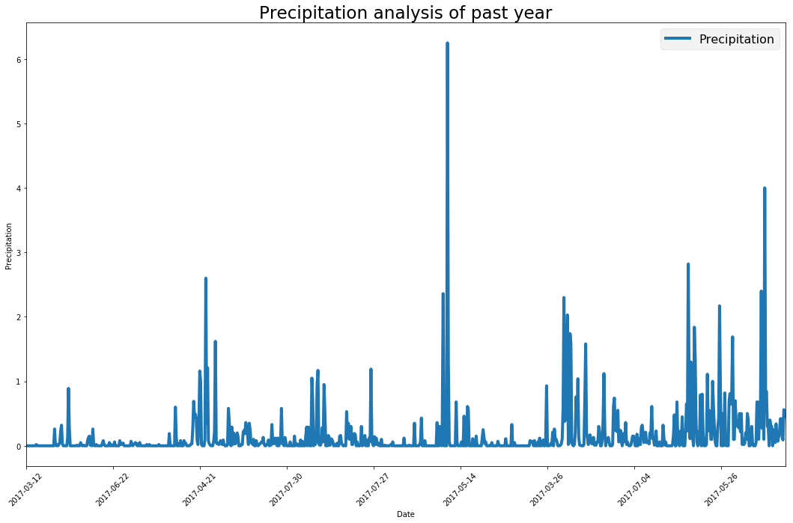
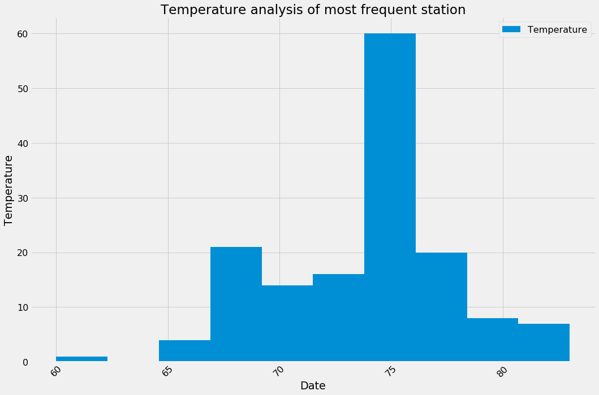
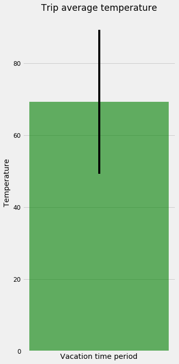
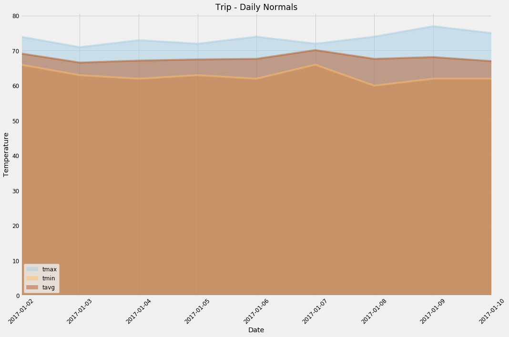
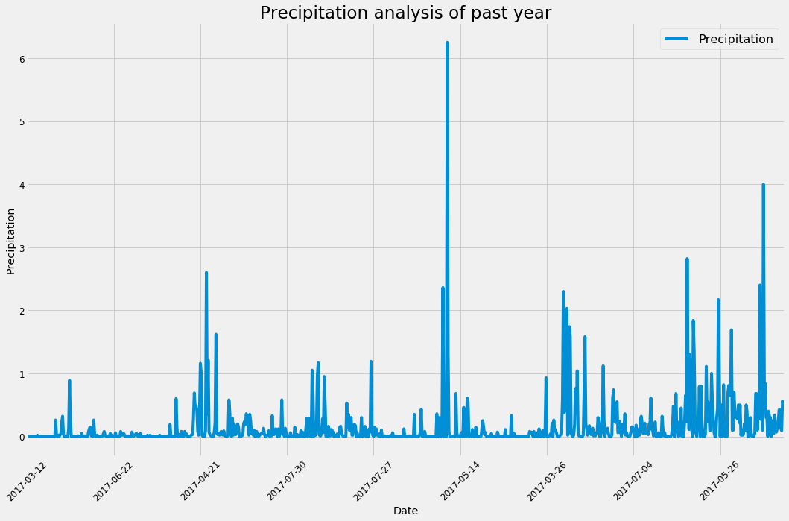
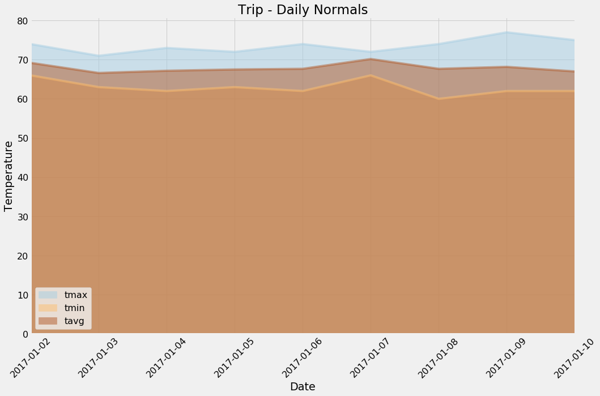

# Climatic Analysis

Performing climatic analysis of Hawaii based on the temperature recorded on different stations


```python
# Python SQL toolkit and Object Relational Mapper
import sqlalchemy
from sqlalchemy.sql import label
from sqlalchemy import func
from sqlalchemy.ext.automap import automap_base
from sqlalchemy.orm import Session
from sqlalchemy import create_engine
import pandas as pd
from sqlalchemy import Column, Integer, String, Numeric, Text, Float,Table,ForeignKey
from flask import jsonify

import matplotlib.pyplot as plt
from matplotlib import cm
import matplotlib

from datetime import datetime,timedelta
```


```python
engine = create_engine("sqlite:///hawaii.sqlite")
Base = automap_base()
Base.prepare(engine, reflect=True)
Base.classes.keys()

Measurements = Base.classes.measurements
Stations = Base.classes.stations

session = Session(engine)

my_table = Table('Measurements', Base.metadata, 
    Column("station", String, ForeignKey("Stations.station")),
    autoload=True,autoload_with=engine)
```

# Precipitation analysis


```python
def precipitation_data():
    current_time = datetime.now()

    past_year = current_time - timedelta(days=365)

    measurements_year = session.query(Measurements.date,Measurements.prcp).filter(
        Measurements.date > past_year).all()

    measure_records = []
    for measure in measurements_year:
        measure_records.append(measure._asdict())

    measurements_df = pd.DataFrame.from_records(measure_records)

    measurements_df = measurements_df.set_index('date')


    return measurements_df
```


```python
precipitation_data()
```


<div>
<style>
    .dataframe thead tr:only-child th {
        text-align: right;
    }

    .dataframe thead th {
        text-align: left;
    }

    .dataframe tbody tr th {
        vertical-align: top;
    }
</style>
<table border="1" class="dataframe">
  <thead>
    <tr style="text-align: right;">
      <th></th>
      <th>prcp</th>
    </tr>
    <tr>
      <th>date</th>
      <th></th>
    </tr>
  </thead>
  <tbody>
    <tr>
      <th>2017-03-12</th>
      <td>0.00</td>
    </tr>
    <tr>
      <th>2017-03-13</th>
      <td>0.00</td>
    </tr>
    <tr>
      <th>2017-03-14</th>
      <td>0.00</td>
    </tr>
    <tr>
      <th>2017-03-15</th>
      <td>0.00</td>
    </tr>
    <tr>
      <th>2017-03-16</th>
      <td>0.00</td>
    </tr>
    <tr>
      <th>2017-03-17</th>
      <td>0.00</td>
    </tr>
    <tr>
      <th>2017-03-18</th>
      <td>0.00</td>
    </tr>
    <tr>
      <th>2017-03-19</th>
      <td>0.00</td>
    </tr>
    <tr>
      <th>2017-03-20</th>
      <td>0.00</td>
    </tr>
    <tr>
      <th>2017-03-21</th>
      <td>0.00</td>
    </tr>
    <tr>
      <th>2017-03-22</th>
      <td>0.00</td>
    </tr>
    <tr>
      <th>2017-03-23</th>
      <td>0.00</td>
    </tr>
    <tr>
      <th>2017-03-24</th>
      <td>0.02</td>
    </tr>
    <tr>
      <th>2017-03-25</th>
      <td>0.00</td>
    </tr>
    <tr>
      <th>2017-03-26</th>
      <td>0.00</td>
    </tr>
    <tr>
      <th>2017-03-27</th>
      <td>0.00</td>
    </tr>
    <tr>
      <th>2017-03-28</th>
      <td>0.00</td>
    </tr>
    <tr>
      <th>2017-03-29</th>
      <td>0.00</td>
    </tr>
    <tr>
      <th>2017-03-30</th>
      <td>0.00</td>
    </tr>
    <tr>
      <th>2017-03-31</th>
      <td>0.00</td>
    </tr>
    <tr>
      <th>2017-04-01</th>
      <td>0.00</td>
    </tr>
    <tr>
      <th>2017-04-02</th>
      <td>0.00</td>
    </tr>
    <tr>
      <th>2017-04-03</th>
      <td>0.00</td>
    </tr>
    <tr>
      <th>2017-04-04</th>
      <td>0.00</td>
    </tr>
    <tr>
      <th>2017-04-05</th>
      <td>0.00</td>
    </tr>
    <tr>
      <th>2017-04-06</th>
      <td>0.00</td>
    </tr>
    <tr>
      <th>2017-04-07</th>
      <td>0.00</td>
    </tr>
    <tr>
      <th>2017-04-08</th>
      <td>0.00</td>
    </tr>
    <tr>
      <th>2017-04-09</th>
      <td>0.00</td>
    </tr>
    <tr>
      <th>2017-04-10</th>
      <td>0.00</td>
    </tr>
    <tr>
      <th>...</th>
      <td>...</td>
    </tr>
    <tr>
      <th>2017-07-17</th>
      <td>0.39</td>
    </tr>
    <tr>
      <th>2017-07-18</th>
      <td>2.40</td>
    </tr>
    <tr>
      <th>2017-07-19</th>
      <td>0.27</td>
    </tr>
    <tr>
      <th>2017-07-20</th>
      <td>0.70</td>
    </tr>
    <tr>
      <th>2017-07-21</th>
      <td>0.10</td>
    </tr>
    <tr>
      <th>2017-07-22</th>
      <td>4.00</td>
    </tr>
    <tr>
      <th>2017-07-23</th>
      <td>0.80</td>
    </tr>
    <tr>
      <th>2017-07-24</th>
      <td>0.84</td>
    </tr>
    <tr>
      <th>2017-07-25</th>
      <td>0.30</td>
    </tr>
    <tr>
      <th>2017-07-26</th>
      <td>0.30</td>
    </tr>
    <tr>
      <th>2017-07-27</th>
      <td>0.00</td>
    </tr>
    <tr>
      <th>2017-07-28</th>
      <td>0.40</td>
    </tr>
    <tr>
      <th>2017-07-29</th>
      <td>0.30</td>
    </tr>
    <tr>
      <th>2017-07-30</th>
      <td>0.30</td>
    </tr>
    <tr>
      <th>2017-07-31</th>
      <td>0.00</td>
    </tr>
    <tr>
      <th>2017-08-02</th>
      <td>0.25</td>
    </tr>
    <tr>
      <th>2017-08-03</th>
      <td>0.06</td>
    </tr>
    <tr>
      <th>2017-08-07</th>
      <td>0.05</td>
    </tr>
    <tr>
      <th>2017-08-08</th>
      <td>0.34</td>
    </tr>
    <tr>
      <th>2017-08-09</th>
      <td>0.15</td>
    </tr>
    <tr>
      <th>2017-08-10</th>
      <td>0.07</td>
    </tr>
    <tr>
      <th>2017-08-12</th>
      <td>0.14</td>
    </tr>
    <tr>
      <th>2017-08-14</th>
      <td>0.22</td>
    </tr>
    <tr>
      <th>2017-08-15</th>
      <td>0.42</td>
    </tr>
    <tr>
      <th>2017-08-16</th>
      <td>0.42</td>
    </tr>
    <tr>
      <th>2017-08-17</th>
      <td>0.13</td>
    </tr>
    <tr>
      <th>2017-08-19</th>
      <td>0.09</td>
    </tr>
    <tr>
      <th>2017-08-21</th>
      <td>0.56</td>
    </tr>
    <tr>
      <th>2017-08-22</th>
      <td>0.50</td>
    </tr>
    <tr>
      <th>2017-08-23</th>
      <td>0.45</td>
    </tr>
  </tbody>
</table>
<p>875 rows × 1 columns</p>
</div>


```python
def showprecipitation():
    measurements_df = precipitation_data()

    measurements_df.plot(kind="line",linewidth=4,figsize=(15,10))

    plt.style.use('fivethirtyeight')

    matplotlib.rcParams.update({'font.size': 16})

    plt.xlabel("Date")
    plt.ylabel("Precipitation")
    plt.title(f"Precipitation analysis of past year")
    plt.xticks(rotation=45)
    plt.legend(["Precipitation"])
    plt.tight_layout()
    plt.savefig("figures/PrecipitationAnalysis_Hawaii.png")
    
    plt.show()
```


```python
showprecipitation()
```





# Station Analysis


```python
def gettotalstations():
    total_stations = session.query(Stations).distinct().count()
    print(f"Total number of stations: {total_stations}")
```


```python
gettotalstations()
```

    Total number of stations: 9
    


```python
def stations_wfrequency():
    active_stations = session.query(Stations.name,Stations.station,label('number_of_obs',func.count(Measurements.id))).\
                    filter(Measurements.station == Stations.station).\
    group_by(Stations.name,Stations.station).order_by(func.count(Measurements.id).desc())
    
    active_station_records = []
    for station in active_stations:
        active_station_records.append(station._asdict())

    active_station_df = pd.DataFrame.from_records(active_station_records)
    
    return active_station_df
```


```python
stations_wfrequency()
```


<div>
<style>
    .dataframe thead tr:only-child th {
        text-align: right;
    }

    .dataframe thead th {
        text-align: left;
    }

    .dataframe tbody tr th {
        vertical-align: top;
    }
</style>
<table border="1" class="dataframe">
  <thead>
    <tr style="text-align: right;">
      <th></th>
      <th>name</th>
      <th>number_of_obs</th>
      <th>station</th>
    </tr>
  </thead>
  <tbody>
    <tr>
      <th>0</th>
      <td>WAIHEE 837.5, HI US</td>
      <td>2772</td>
      <td>USC00519281</td>
    </tr>
    <tr>
      <th>1</th>
      <td>KANEOHE 838.1, HI US</td>
      <td>2696</td>
      <td>USC00513117</td>
    </tr>
    <tr>
      <th>2</th>
      <td>WAIKIKI 717.2, HI US</td>
      <td>2685</td>
      <td>USC00519397</td>
    </tr>
    <tr>
      <th>3</th>
      <td>WAIMANALO EXPERIMENTAL FARM, HI US</td>
      <td>2572</td>
      <td>USC00519523</td>
    </tr>
    <tr>
      <th>4</th>
      <td>MANOA LYON ARBO 785.2, HI US</td>
      <td>2484</td>
      <td>USC00516128</td>
    </tr>
    <tr>
      <th>5</th>
      <td>KUALOA RANCH HEADQUARTERS 886.9, HI US</td>
      <td>1937</td>
      <td>USC00514830</td>
    </tr>
    <tr>
      <th>6</th>
      <td>HONOLULU OBSERVATORY 702.2, HI US</td>
      <td>1932</td>
      <td>USC00511918</td>
    </tr>
    <tr>
      <th>7</th>
      <td>PEARL CITY, HI US</td>
      <td>683</td>
      <td>USC00517948</td>
    </tr>
    <tr>
      <th>8</th>
      <td>UPPER WAHIAWA 874.3, HI US</td>
      <td>342</td>
      <td>USC00518838</td>
    </tr>
  </tbody>
</table>
</div>


```python
def getstationslist():
    active_station_df = stations_wfrequency()

    stations = active_station_df[['name','station']]

    return stations
```


```python
getstationslist()
```


<div>
<style>
    .dataframe thead tr:only-child th {
        text-align: right;
    }

    .dataframe thead th {
        text-align: left;
    }

    .dataframe tbody tr th {
        vertical-align: top;
    }
</style>
<table border="1" class="dataframe">
  <thead>
    <tr style="text-align: right;">
      <th></th>
      <th>name</th>
      <th>station</th>
    </tr>
  </thead>
  <tbody>
    <tr>
      <th>0</th>
      <td>WAIHEE 837.5, HI US</td>
      <td>USC00519281</td>
    </tr>
    <tr>
      <th>1</th>
      <td>KANEOHE 838.1, HI US</td>
      <td>USC00513117</td>
    </tr>
    <tr>
      <th>2</th>
      <td>WAIKIKI 717.2, HI US</td>
      <td>USC00519397</td>
    </tr>
    <tr>
      <th>3</th>
      <td>WAIMANALO EXPERIMENTAL FARM, HI US</td>
      <td>USC00519523</td>
    </tr>
    <tr>
      <th>4</th>
      <td>MANOA LYON ARBO 785.2, HI US</td>
      <td>USC00516128</td>
    </tr>
    <tr>
      <th>5</th>
      <td>KUALOA RANCH HEADQUARTERS 886.9, HI US</td>
      <td>USC00514830</td>
    </tr>
    <tr>
      <th>6</th>
      <td>HONOLULU OBSERVATORY 702.2, HI US</td>
      <td>USC00511918</td>
    </tr>
    <tr>
      <th>7</th>
      <td>PEARL CITY, HI US</td>
      <td>USC00517948</td>
    </tr>
    <tr>
      <th>8</th>
      <td>UPPER WAHIAWA 874.3, HI US</td>
      <td>USC00518838</td>
    </tr>
  </tbody>
</table>
</div>


```python
def getmostfreqstation():
    active_station_df = stations_wfrequency()
    
    freq_station = {'id':"",'name':""}
    freq_station['id'] = active_station_df.iloc[:1]['station'][0]

    freq_station['name'] = active_station_df.iloc[:1]['name'][0]
    
    return freq_station
```


```python
getmostfreqstation()
```


    {'id': 'USC00519281', 'name': 'WAIHEE 837.5, HI US'}


```python
def get_temperature_obs():
    current_time = datetime.now()

    past_year = current_time - timedelta(days=365)
    
    freq_station_id = getmostfreqstation()['id']

    measure_freq_station = session.query(Measurements.date,Measurements.tobs).\
                        filter(Measurements.station == freq_station_id).\
                        filter(Measurements.date > past_year).all()

    station_measures = []
    for measure in measure_freq_station:
        station_measures.append(measure._asdict())

    station_measures_df = pd.DataFrame.from_records(station_measures)

    station_measures_df = station_measures_df.set_index('date')


    return station_measures_df
    
```


```python
get_temperature_obs()
```


<div>
<style>
    .dataframe thead tr:only-child th {
        text-align: right;
    }

    .dataframe thead th {
        text-align: left;
    }

    .dataframe tbody tr th {
        vertical-align: top;
    }
</style>
<table border="1" class="dataframe">
  <thead>
    <tr style="text-align: right;">
      <th></th>
      <th>tobs</th>
    </tr>
    <tr>
      <th>date</th>
      <th></th>
    </tr>
  </thead>
  <tbody>
    <tr>
      <th>2017-03-12</th>
      <td>69</td>
    </tr>
    <tr>
      <th>2017-03-13</th>
      <td>66</td>
    </tr>
    <tr>
      <th>2017-03-14</th>
      <td>67</td>
    </tr>
    <tr>
      <th>2017-03-15</th>
      <td>69</td>
    </tr>
    <tr>
      <th>2017-03-16</th>
      <td>66</td>
    </tr>
    <tr>
      <th>2017-03-17</th>
      <td>68</td>
    </tr>
    <tr>
      <th>2017-03-18</th>
      <td>65</td>
    </tr>
    <tr>
      <th>2017-03-19</th>
      <td>74</td>
    </tr>
    <tr>
      <th>2017-03-20</th>
      <td>69</td>
    </tr>
    <tr>
      <th>2017-03-21</th>
      <td>72</td>
    </tr>
    <tr>
      <th>2017-03-22</th>
      <td>73</td>
    </tr>
    <tr>
      <th>2017-03-23</th>
      <td>72</td>
    </tr>
    <tr>
      <th>2017-03-24</th>
      <td>71</td>
    </tr>
    <tr>
      <th>2017-03-25</th>
      <td>76</td>
    </tr>
    <tr>
      <th>2017-03-26</th>
      <td>77</td>
    </tr>
    <tr>
      <th>2017-03-27</th>
      <td>76</td>
    </tr>
    <tr>
      <th>2017-03-28</th>
      <td>74</td>
    </tr>
    <tr>
      <th>2017-03-29</th>
      <td>68</td>
    </tr>
    <tr>
      <th>2017-03-30</th>
      <td>73</td>
    </tr>
    <tr>
      <th>2017-03-31</th>
      <td>71</td>
    </tr>
    <tr>
      <th>2017-04-01</th>
      <td>74</td>
    </tr>
    <tr>
      <th>2017-04-02</th>
      <td>75</td>
    </tr>
    <tr>
      <th>2017-04-03</th>
      <td>70</td>
    </tr>
    <tr>
      <th>2017-04-04</th>
      <td>67</td>
    </tr>
    <tr>
      <th>2017-04-05</th>
      <td>71</td>
    </tr>
    <tr>
      <th>2017-04-06</th>
      <td>67</td>
    </tr>
    <tr>
      <th>2017-04-07</th>
      <td>74</td>
    </tr>
    <tr>
      <th>2017-04-08</th>
      <td>77</td>
    </tr>
    <tr>
      <th>2017-04-09</th>
      <td>78</td>
    </tr>
    <tr>
      <th>2017-04-10</th>
      <td>67</td>
    </tr>
    <tr>
      <th>...</th>
      <td>...</td>
    </tr>
    <tr>
      <th>2017-07-11</th>
      <td>72</td>
    </tr>
    <tr>
      <th>2017-07-12</th>
      <td>74</td>
    </tr>
    <tr>
      <th>2017-07-13</th>
      <td>74</td>
    </tr>
    <tr>
      <th>2017-07-14</th>
      <td>76</td>
    </tr>
    <tr>
      <th>2017-07-15</th>
      <td>80</td>
    </tr>
    <tr>
      <th>2017-07-16</th>
      <td>80</td>
    </tr>
    <tr>
      <th>2017-07-17</th>
      <td>76</td>
    </tr>
    <tr>
      <th>2017-07-18</th>
      <td>76</td>
    </tr>
    <tr>
      <th>2017-07-19</th>
      <td>76</td>
    </tr>
    <tr>
      <th>2017-07-20</th>
      <td>77</td>
    </tr>
    <tr>
      <th>2017-07-21</th>
      <td>77</td>
    </tr>
    <tr>
      <th>2017-07-22</th>
      <td>77</td>
    </tr>
    <tr>
      <th>2017-07-23</th>
      <td>82</td>
    </tr>
    <tr>
      <th>2017-07-24</th>
      <td>75</td>
    </tr>
    <tr>
      <th>2017-07-25</th>
      <td>77</td>
    </tr>
    <tr>
      <th>2017-07-26</th>
      <td>75</td>
    </tr>
    <tr>
      <th>2017-07-27</th>
      <td>76</td>
    </tr>
    <tr>
      <th>2017-07-28</th>
      <td>81</td>
    </tr>
    <tr>
      <th>2017-07-29</th>
      <td>82</td>
    </tr>
    <tr>
      <th>2017-07-30</th>
      <td>81</td>
    </tr>
    <tr>
      <th>2017-07-31</th>
      <td>76</td>
    </tr>
    <tr>
      <th>2017-08-04</th>
      <td>77</td>
    </tr>
    <tr>
      <th>2017-08-05</th>
      <td>82</td>
    </tr>
    <tr>
      <th>2017-08-06</th>
      <td>83</td>
    </tr>
    <tr>
      <th>2017-08-13</th>
      <td>77</td>
    </tr>
    <tr>
      <th>2017-08-14</th>
      <td>77</td>
    </tr>
    <tr>
      <th>2017-08-15</th>
      <td>77</td>
    </tr>
    <tr>
      <th>2017-08-16</th>
      <td>76</td>
    </tr>
    <tr>
      <th>2017-08-17</th>
      <td>76</td>
    </tr>
    <tr>
      <th>2017-08-18</th>
      <td>79</td>
    </tr>
  </tbody>
</table>
<p>151 rows × 1 columns</p>
</div>


```python
def showtemperature():
    station_measures_df = get_temperature_obs()
    
#     print(jsonify(station_measures_df))

    station_measures_df.plot(kind="hist",linewidth=4,figsize=(15,10))

    plt.style.use('fivethirtyeight')

    matplotlib.rcParams.update({'font.size': 16})

    plt.xlabel("Date")
    plt.ylabel("Temperature")
    plt.title(f"Temperature analysis of most frequent station")
    plt.xticks(rotation=45)
    plt.legend(["Temperature"])
    plt.tight_layout()
    plt.savefig("figures/TemperatureAnalysis_Hawaii.png")

    plt.show()
```


```python
showtemperature()
```





# Trip analysis


```python
def calctemps(startdate,enddate):
    compstart = startdate - timedelta(days=365)
    compend = enddate - timedelta(days=365)
    
    temperature_vacation = session.query(label('max_temp',func.max(Measurements.tobs)),\
                                     label('min_temp',func.min(Measurements.tobs)),\
                                     label('avg_temp',func.avg(Measurements.tobs))).\
                    filter(Measurements.date >= compstart).\
                    filter(Measurements.date <= compend)
    
    Max_temp = temperature_vacation[0].max_temp
    Min_temp = temperature_vacation[0].min_temp
    Avg_temp = temperature_vacation[0].avg_temp
    
    yerror = Max_temp - Min_temp
    
    barvalue = [Avg_temp]
    xvals = range(len(barvalue))
    matplotlib.rcParams.update({'font.size': 12})
    
    fig,ax = plt.subplots(figsize=(5,10))
    ax.bar(xvals, barvalue, yerr=yerror, color='g',alpha=0.6)
    ax.set_xticks([1]) 
    plt.xlabel("Vacation time period")
    plt.ylabel("Temperature")
    plt.title("Trip average temperature")
    plt.tight_layout()
    plt.savefig("figures\Tripavg.png")
    
    plt.show()


```


```python
calctemps(datetime(2018,1,1),datetime(2018,1,20))
```





```python
def calcrainfall(startdate,enddate):
    compstart = startdate - timedelta(days=365)
    compend = enddate - timedelta(days=365)
    
    rainfall_per_station = session.query(Stations.name,Stations.station,label('avg_rainfall',func.avg(Measurements.prcp))).\
                    filter(Measurements.station == Stations.station).\
                    filter(Measurements.date >= compstart).\
                    filter(Measurements.date <= compend).\
    group_by(Stations.name,Stations.station).order_by(func.avg(Measurements.prcp))
    
    df = pd.DataFrame(query_to_dict(rainfall_per_station))
       
    return df


def query_to_dict(res):
    res_dict = []
    for rec in res:
        res_dict.append(rec)
    
    return res_dict
        

```


```python
calcrainfall(datetime(2018,1,1),datetime(2018,1,20))
```


<div>
<style>
    .dataframe thead tr:only-child th {
        text-align: right;
    }

    .dataframe thead th {
        text-align: left;
    }

    .dataframe tbody tr th {
        vertical-align: top;
    }
</style>
<table border="1" class="dataframe">
  <thead>
    <tr style="text-align: right;">
      <th></th>
      <th>name</th>
      <th>station</th>
      <th>avg_rainfall</th>
    </tr>
  </thead>
  <tbody>
    <tr>
      <th>0</th>
      <td>PEARL CITY, HI US</td>
      <td>USC00517948</td>
      <td>0.000000</td>
    </tr>
    <tr>
      <th>1</th>
      <td>WAIKIKI 717.2, HI US</td>
      <td>USC00519397</td>
      <td>0.000000</td>
    </tr>
    <tr>
      <th>2</th>
      <td>KANEOHE 838.1, HI US</td>
      <td>USC00513117</td>
      <td>0.003158</td>
    </tr>
    <tr>
      <th>3</th>
      <td>WAIHEE 837.5, HI US</td>
      <td>USC00519281</td>
      <td>0.010526</td>
    </tr>
    <tr>
      <th>4</th>
      <td>MANOA LYON ARBO 785.2, HI US</td>
      <td>USC00516128</td>
      <td>0.035789</td>
    </tr>
    <tr>
      <th>5</th>
      <td>KUALOA RANCH HEADQUARTERS 886.9, HI US</td>
      <td>USC00514830</td>
      <td>0.042000</td>
    </tr>
    <tr>
      <th>6</th>
      <td>WAIMANALO EXPERIMENTAL FARM, HI US</td>
      <td>USC00519523</td>
      <td>0.061000</td>
    </tr>
  </tbody>
</table>
</div>


```python
def dailynormals(startdate,enddate):
    df = pd.DataFrame()
    session = Session(engine)
    compstart = datetime.strptime(startdate,"%m-%d") - timedelta(days=365)
    compend = datetime.strptime(enddate,"%m-%d") - timedelta(days=365)
    
    compstart = compstart.replace(year = 2017)
    
    compend = compend.replace(year = 2017)
    
    print(f"compstart-{compstart} : compend-{compend}")
    
    daily_temperatures = session.query(Measurements.date,label('tmax',func.max(Measurements.tobs)),\
                                      label('tmin',func.min(Measurements.tobs)),
                                      label('tavg',func.avg(Measurements.tobs)),).\
                    filter(Measurements.date >= compstart).\
                    filter(Measurements.date <= compend).\
    group_by(Measurements.date).order_by(Measurements.date)
    
    df = pd.DataFrame(query_to_dict(daily_temperatures))
    
    print(f"dataframe columns - {df.columns}")
    
    if('date' in df.columns):
        df = df.set_index('date')
    
    return df
```


```python
dailynormals('01-01','01-02')
```

    compstart-2017-01-01 00:00:00 : compend-2017-01-02 00:00:00
    dataframe columns - Index(['date', 'tmax', 'tmin', 'tavg'], dtype='object')
    


<div>
<style>
    .dataframe thead tr:only-child th {
        text-align: right;
    }

    .dataframe thead th {
        text-align: left;
    }

    .dataframe tbody tr th {
        vertical-align: top;
    }
</style>
<table border="1" class="dataframe">
  <thead>
    <tr style="text-align: right;">
      <th></th>
      <th>tmax</th>
      <th>tmin</th>
      <th>tavg</th>
    </tr>
    <tr>
      <th>date</th>
      <th></th>
      <th></th>
      <th></th>
    </tr>
  </thead>
  <tbody>
    <tr>
      <th>2017-01-02</th>
      <td>74</td>
      <td>66</td>
      <td>69.2</td>
    </tr>
  </tbody>
</table>
</div>


```python
def showdailynormals():
    dailynormals_df = dailynormals('01-01','01-10')
    dailynormals_df.plot(kind='area',stacked=False,figsize=(15,10),alpha=0.50,cmap = cm.get_cmap('Paired'))

    plt.xlabel("Date")
    plt.ylabel("Temperature")
    plt.title(f"Trip - Daily Normals")
    plt.xticks(rotation=45)
    plt.tight_layout()
    plt.savefig("figures/trip_dailynormals.png")

    plt.show()
```


```python
showdailynormals()
```

    compstart-2017-01-01 00:00:00 : compend-2017-01-10 00:00:00
    dataframe columns - Index(['date', 'tmax', 'tmin', 'tavg'], dtype='object')
    





```python
def performclimateanalysis():
    
    showprecipitation()
    
    showtemperature()
    
    print(getstationslist().head())
    
    showdailynormals()
    
    
```


```python
performclimateanalysis()
```





                                     name      station
    0                 WAIHEE 837.5, HI US  USC00519281
    1                KANEOHE 838.1, HI US  USC00513117
    2                WAIKIKI 717.2, HI US  USC00519397
    3  WAIMANALO EXPERIMENTAL FARM, HI US  USC00519523
    4        MANOA LYON ARBO 785.2, HI US  USC00516128
    compstart-2017-01-01 00:00:00 : compend-2017-01-10 00:00:00
    dataframe columns - Index(['date', 'tmax', 'tmin', 'tavg'], dtype='object')
    




